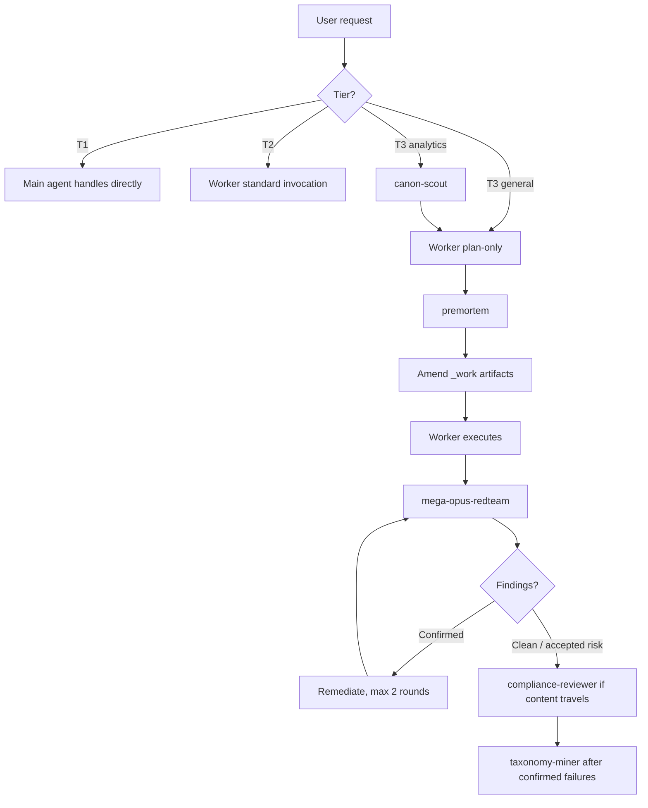

# dotclaude

`dotclaude` is a small prompt-engineering repo for high-rigor Claude-style agent work. It is not an application or library; it is a set of Markdown agent definitions, skill packages, and orchestration notes for work where being wrong is expensive.

The core idea is simple: route work by **cost of being wrong**, then spend only the amount of verification that cost justifies. Low-stakes work stays lightweight. High-stakes work gets provenance checks, explicit assumptions, mechanical gates, premortem review, adversarial redteam, compliance screening, and post-failure taxonomy mining.

## What Is Here

| File | Purpose |
|---|---|
| [`fleet-orchestration.md`](fleet-orchestration.md) | The conductor protocol: tier routing, T3 lifecycle, handoff payloads, verdict handling, relay discipline. Read this first. |
| [`mega-opus-generalist.md`](mega-opus-generalist.md) | High-rigor worker for complex non-analytics tasks: research, writing, code, planning, reviews, decision support. |
| [`mega-opus-analytics.md`](mega-opus-analytics.md) | High-rigor worker for stakeholder-facing SQL and analytics: metric definitions, recon, query discipline, verification ledger, recomputation. |
| [`canon-scout.md`](canon-scout.md) | Metric provenance agent: finds canonical definitions, variants, conflicts, and anchor values before analytics work starts. |
| [`premortem.md`](premortem.md) | Pre-execution plan attacker: reads the worker's plan before sunk cost exists and proposes targeted amendments. |
| [`mega-opus-redteam.md`](mega-opus-redteam.md) | Post-delivery adversarial verifier: attacks claims under strict input isolation and audits the evidence ledger. |
| [`compliance-reviewer.md`](compliance-reviewer.md) | Financial-services regulatory preflight: flags FINRA 2210 / SEC Marketing Rule risks and never clears content. |
| [`taxonomy-miner.md`](taxonomy-miner.md) | Failure distillation agent: turns confirmed misses into taxonomy entries and known-answer test proposals. |
| [`skills/analytics-spec-builder/SKILL.md`](skills/analytics-spec-builder/SKILL.md) | Installable skill for turning scoped analytics requests into implementation-ready specs. |
| [`skills/analytics-spec-builder.zip`](skills/analytics-spec-builder.zip) | Packaged copy of the analytics spec builder skill for installation or distribution. |
| [`skills/expo-mobile-app/SKILL.md`](skills/expo-mobile-app/SKILL.md) | Installable skill for building, reviewing, refactoring, and polishing Expo / React Native apps. |
| [`skills/expo-mobile-app-skill.zip`](skills/expo-mobile-app-skill.zip) | Packaged copy of the Expo mobile app skill for installation or distribution. |
| [`skills/gpt-5.5-xhigh/SKILL.md`](skills/gpt-5.5-xhigh/SKILL.md) | Installable operating-mode skill for high-rigor analytics, BI, strategy, and executive decision-support work. |
| [`skills/gpt-5.5-xhigh-skill.zip`](skills/gpt-5.5-xhigh-skill.zip) | Packaged copy of the GPT-5.5-xhigh operating skill for installation or distribution. |
| [`skills/can-and-must-do-better/SKILL.md`](skills/can-and-must-do-better/SKILL.md) | Installable second-pass self-review skill for improving analytics, BI, strategy, code, and writing deliverables. |
| [`skills/can-and-must-do-better-skill.zip`](skills/can-and-must-do-better-skill.zip) | Packaged copy of the can-and-must-do-better skill for installation or distribution. |
| [`Research Report.md`](Research%20Report.md) | Point-in-time June 2026 source material for a future Expo + beautiful mobile UI skill. Verify recency-sensitive claims before using. |

Most files with frontmatter are intended to be usable as subagent definitions in a Claude Code-style environment. The orchestration file is for the main caller, not for the subagents themselves.

## Architecture

The fleet is built around separations of role, timing, and information:

- Workers produce deliverables and evidence.
- `canon-scout` resolves metric definitions before analytics work can invent them.
- `premortem` sees the plan before execution, when changes are cheap.
- `mega-opus-redteam` sees only deliverables, raw inputs, and evidence, never the worker's reasoning.
- `compliance-reviewer` screens anything that could travel to regulated audiences, but never issues clearance.
- `taxonomy-miner` closes the learning loop after confirmed failures.

## Tiering

The tiers are a single dial: **cost of being wrong**. They appear in the fleet orchestration and both mega agents with consistent meaning.

| Tier | Use When | Rigor That Fires |
|---|---|---|
| **T1 — light** | Single-step, cheap to be wrong, easily reversed. Examples: a lookup, quick transformation, throwaway query. | Premise check and tripwire scan. No AUQ file, no gates, no critique pass. The main agent usually handles it directly. |
| **T2 — standard** | Multi-step, or moderate cost of error. Real work, but not especially high visibility. | AUQ with STOP gate on undispositioned Unknowns, taxonomy tripwire scan, mechanical gates, inversion pass. Usually one worker invocation. |
| **T3 — full** | Expensive to be wrong, stakeholder-facing, statistical/causal/legal/financial claims, or long agentic sessions where drift becomes likely. | Full machinery: plan-only worker, premortem, amended execution, independent re-derivation, long-horizon checkpointing, redteam, compliance when relevant, taxonomy mining after failures. |

The triage question is not "is this hard?" or "will this take long?" It is: **what does being wrong cost here?** A one-line SQL change that informs leadership is T3. A sprawling exploratory analysis nobody will act on may be T1.

When torn between tiers, go up one. Over-rigor costs minutes; under-rigor costs a wrong deliverable that looked trustworthy.

One caveat: the T3 `>30 minutes` heuristic is the softest criterion. It is a proxy for enough elapsed work that drift, stale assumptions, and constraint decay become real risks, not a direct measure of stakes.

## T3 Lifecycle

For high-stakes work, the intended sequence is:

1. **canon-scout** for analytics tasks with unresolved metric definitions.
2. **worker plan-only** using the user's request quoted verbatim.
3. **premortem** against the brief, AUQ, plan, gates, and scope fence.
4. **amend `_work/` artifacts** directly so the worker re-reads the corrected plan as ground truth.
5. **worker execution** with evidence, gates, and relay caveats.
6. **mega-opus-redteam** with deliverable, raw inputs, and evidence ledger only.
7. **remediation loop** for confirmed redteam findings, capped at two rounds.
8. **compliance-reviewer** before anything external, regulated, or likely to travel.
9. **taxonomy-miner** for confirmed failures, binding failures, or uncatalogued error patterns.

Skip steps consciously, not silently. If a T3 run skips premortem, redteam, or compliance review, that absence is information the user should see.

## Agent Design Notes

**mega-opus-generalist** is the general high-rigor worker. Its failure model is lossy delegation: the brief is compressed, mid-run user questions are unavailable, and the final message is the product. It counters that with task reconstruction, AUQ, explicit gates, prediction-before-action, domain-specific disciplines, inversion pass, and a structured return contract.

**mega-opus-analytics** specializes that same discipline for SQL and stakeholder numbers. It emphasizes canonical metric definitions, table reconnaissance before analysis, grain/null/freshness checks, staged CTE checkpoints, join fan-out protection, ratio discipline, independent recomputation, and prose-level safeguards against turning correct numbers into wrong claims.

**canon-scout** is verbatim-or-nothing on metric definitions. Variants are conflicts, never blended consensus. `not-found` is a first-class verdict with search strategies listed, so the worker knows exactly what was ruled out before defining-and-flagging.

**premortem** has temporal independence rather than informational isolation. It reads the plan artifacts before sunk cost exists, assumes the deliverable failed, writes specific past-tense postmortems, then returns at most five amendments. Every amendment must say how it would have prevented a named postmortem.

**mega-opus-redteam** is a falsifier, not a reviewer. Its most important invariant is input isolation: it may read deliverables, raw inputs, and evidence ledgers, but not AUQ, checkpoints, plans, drafts, or reasoning transcripts. If reasoning leaks into the brief, it reports `ISOLATION: breached`. It also audits evidence directly, so verification theater is itself a confirmed finding.

**compliance-reviewer** is structurally incapable of clearance. Its best positive verdict is no flags found at this screen level, with human compliance review still required. It combines mechanical pattern screens with two adversarial reads: the least sophisticated likely reader and the examiner with a highlighter.

**taxonomy-miner** protects the improvement loop from anecdote laundering. It reads existing taxonomy canon before evidence, distinguishes new entries from amendments, parks one-off incidents as candidates, and treats already-covered failures as binding failures of the protocol rather than taxonomy gaps.

## Skill Packages

**analytics-spec-builder** is a reusable skill for spec-driven analytics work. Use it when the user wants to create, tighten, review, or improve a specification for a scoped analytics deliverable: dashboards, reports, SQL/dbt models, metric definitions, semantic-layer changes, experiment or cohort analyses, data quality checks, reconciliations, KPI automation, notebooks, or analytics refactors.

The skill's job is to make analytics work implementation-ready before code changes begin. It inspects relevant repo context, asks targeted high-value questions, separates facts from assumptions, and produces a spec with scope, data sources, metric logic, grain, filters, validation plan, acceptance criteria, risks, and open questions.

Its core stance is deliberately pre-implementation:

- Ask 3-5 material clarifying questions when important details are missing.
- Do not ask what the repo can answer through read-only inspection.
- Treat metric formulas, grain, filters, joins, refresh cadence, privacy constraints, and validation as contract details.
- Avoid editing production code or dashboards while still in spec-building mode.
- Keep the scope task-sized; split broad programs into separate analytics specs.

**expo-mobile-app** is a reusable skill for Expo and React Native application work across iOS, Android, and web. Use it when the task touches Expo Router, app architecture, native-feeling UI, design systems, animation, gestures, haptics, accessibility, performance, native modules, testing, EAS Build/Update, or refactoring an existing Expo codebase.

The skill's job is to make mobile app changes feel native, distinctive, smooth, accessible, and maintainable. It starts with a project audit, preserves existing conventions, prefers Expo-first and TypeScript-first choices, and treats design quality, states, accessibility, performance, and release implications as part of the engineering work.

Its core stance is practical and product-minded:

- Inspect `package.json`, app config, route tree, styling system, data layer, and tests before editing.
- Prefer Expo conventions, Expo SDK modules, config plugins, development builds, and EAS profiles where they fit.
- Match the existing architecture before introducing a new navigation, styling, state, or UI stack.
- Build reusable UI primitives and design tokens before scattering one-off styles.
- Validate non-trivial changes with the narrowest useful checks, such as Expo Doctor, lint, typecheck, tests, or simulator/device review.
- Treat OTA updates, native runtime changes, secrets, permissions, accessibility, safe areas, keyboard behavior, and platform-specific behavior as part of the change contract.

**gpt-5.5-xhigh** is an operating-mode skill for analytics, BI, strategy, finance, dashboarding, data modeling, large synthesis, and ambiguous high-stakes analytical work. It does not claim to change the underlying model; it pushes Claude toward an outcome-first, tool-grounded, verification-heavy style with explicit evidence, assumptions, risks, confidence, and decision implications.

The skill is useful when the work needs senior analytical judgment rather than generic answer completion:

- Frame the real decision, audience, artifact, time horizon, and success criteria.
- Inspect available files, schemas, SQL, dashboards, docs, or data before asserting.
- Define metric grains, windows, filters, numerators, denominators, exclusions, and ownership.
- Validate numbers, reconcile totals, check edge cases, and look for contradictions.
- Lead final answers with the recommendation or answer, then include the evidence and caveats needed to act.
- Run a private "you can and MUST do better" self-evaluation pass before finalizing.

**can-and-must-do-better** is a second-pass review and improvement skill. Use it after producing or modifying a nontrivial artifact, or when the user asks for critique, audit, refinement, revision, final check, or a higher-quality answer before delivery.

The skill's job is not to defend the current draft. It reconstructs the original job, inspects available evidence, applies the relevant review lenses, finds the highest-impact defects, improves the work directly when safe, verifies the result, and repeats once for remaining material issues.

Its core stance is adversarial but constructive:

- Treat "you can and MUST do better" as a demand for concrete improvement, not just critique.
- Prioritize P0/P1 defects over polish.
- Use analytics, code, strategy, writing, security, and communication lenses as applicable.
- Ground the review in files, diffs, queries, specs, drafts, or source material rather than memory.
- Fix the work directly when in scope; otherwise provide exact replacement text, test cases, patches, query changes, or revised analysis.
- Never invent test results, citations, data checks, source contents, or validation.

Each zip archive contains the same `SKILL.md` file as its corresponding source directory. Update the unpacked skill first, then refresh the zip so distribution matches the repo copy.

## Shared Conventions

These files deliberately repeat some conventions because agent definitions cannot import shared text:

- **Return contracts** make outputs relayable by the caller.
- **`RELAY TO USER` fields** preserve caveats, assumptions, and warnings that subagents cannot say directly.
- **`needs-input` early returns** are preferred over confident execution under load-bearing ambiguity.
- **`_work/` evidence dirs** hold AUQ, gates, inventories, checkpoints, ledgers, and verification artifacts.
- **Mechanical gates** are preferred over attestations wherever possible.
- **Completeness accounting** prevents sampling a subset and calling it done.
- **Inversion and redteam passes** manufacture independence where self-review would otherwise approve its own assumptions.
- **Taxonomy tripwires** turn recurring failures into explicit checks.

## How To Use This Repo

1. Read [`fleet-orchestration.md`](fleet-orchestration.md) to understand routing and handoffs.
2. Install or copy the agent definition files into your agent runtime's subagent location.
3. Install or copy skills from `skills/` into your runtime's skill location; use the zip package when an installer expects an archive.
4. Put the orchestration protocol somewhere the main agent will read, such as a project-level instruction file.
5. For T3 analytics work, run `canon-scout` before `mega-opus-analytics`.
6. For T3 worker runs, ask the worker for `plan-only`, run `premortem`, apply accepted amendments into `_work/`, then re-invoke the worker to execute.
7. Invoke `mega-opus-redteam` only with the deliverable, raw inputs, and evidence ledger.
8. Route anything that could travel through `compliance-reviewer`.
9. Feed confirmed failures or user corrections into `taxonomy-miner`.

If your runtime differs from Claude Code-style frontmatter (`name`, `description`, `tools`, `model`), keep the role instructions but adapt the metadata and tool names.

## Maintenance Notes

- Treat [`fleet-orchestration.md`](fleet-orchestration.md) as the normative version of shared orchestration contracts. When a contract changes, update it there first, then propagate to the relevant agents.
- Keep redteam isolation strict. Passing worker reasoning into the redteam makes the redteam verdict materially weaker.
- Keep compliance language conservative. The compliance agent flags and routes; it does not clear.
- Keep taxonomy mining evidence-backed. One incident can be a candidate, but not a fully promoted pattern.
- When changing packaged skills, update the unpacked `SKILL.md` first and regenerate the corresponding zip from that source.
- Check platform assumptions before operationalizing. Some prompts reference specific model names, tool names, and shell commands such as `sha256sum` that may need adaptation on macOS or other runtimes.
- The Expo research report is source material for the Expo mobile app skill. Its ecosystem claims are dated June 2026 and should be verified against official docs before implementation.
- Local runtime files such as `.claude/settings.local.json` may exist for machine-specific permissions and are intentionally not tracked.

## Suggested Next Improvements

- Add one line to each mega agent's Phase 1 recommending T3 plans be routed through `premortem`.
- Add a small install guide for the exact target runtime once the deployment location is chosen.
- Add known-answer fixtures for the analytics/redteam path, especially a passing SRM case that should return `CLEARED` with shown work.
- Add a portability pass for model labels, tool names, and hashing commands.
